# 🤖 AI Customer Support Web-App


## 📚 Index

- [📌 Overview](#-overview)
- [🎯 Key Goals](#-key-goals)
- [🏗️ High-Level Architecture](#-high-level-architecture)
- [🧩 Core Components](#-core-components)
  - [Session Management](#1-session-management)
  - [FAQ System](#2-faq-system)
  - [LLM Integration (Ollama)](#3-llm-integration-ollama)
  - [Escalation Handling](#4-escalation-handling)
  - [Self-Learning FAQ System](#5-self-learning-faq-system)
- [🚀 Running the Project](#-running-the-project)
  - [Prerequisites](#prerequisites)
  - [Start the Backend](#-step-2-start-the-backend)
  - [Start the Frontend](#-step-3-start-frontend)
    
<a id="overview"></a>
## 📌 Overview

This project implements an **AI-powered customer support web-app** that combines:

- FAQ-based responses  
- LLM-based conversational responses  
- Automatic escalation to human support  
- A self-learning FAQ system based on repeated user queries  

The backend is built using **Node.js, Express, MongoDB, and Ollama (local LLM)**.
The frontend is built using **React.**

---

<a id="key-goals"></a>
## 🎯 Key Goals

- Reduce unnecessary LLM calls using FAQs  
- Automatically learn new FAQs from repeated queries  
- Avoid vendor lock-in (no paid API dependencies)  
- Keep latency low and logic transparent   

---

<a id="architecture"></a>
## 🏗️ High-Level Architecture

```mermaid
flowchart TD
    A[Client] --> B["start-session API"] --> C["chat API"]
    C --> D{FAQ Match?}
    D -- Yes --> E[Return FAQ Answer]
    D -- No --> F["LLM Response (Ollama)"]
    F --> G{Needs Escalation?}
    G -- Yes --> H["Log Escalation<br/>Update Session Status"]
    G -- No --> I[Track Query Frequency]
    I --> J{"Count ≥ 5?"}
    J -- Yes --> K[Promote to FAQ]
    J -- No --> L[Store QueryStat]
    E --> M[Response to Client]
    H --> M
    K --> M
    L --> M
  
```


---

<a id="core-components"></a>
## 🧩 Core Components

<a id="session-management"></a>
### 1. Session Management

Each conversation happens within a session.

**Session lifecycle:**
- Created via `start-session`
- Used for all `/chat` interactions
- Stores message history
- Tracks escalation status

---

<a id="faq-system"></a>
### 2. FAQ System

FAQs are stored in the database and include:
- question
- answer
- vector embedding

When a user sends a query:
1. The query is vectorized
2. It is matched against existing FAQ embeddings
3. If similarity is above a threshold → FAQ answer is returned
4. Otherwise → fallback to LLM

**Why embeddings?**  
They allow semantic matching instead of exact text matching.

---

<a id="llm-integration"></a>
### 3. LLM Integration (Ollama)

The system uses **Ollama** to run LLMs locally.

**Why Ollama?**
- Completely free
- No API keys
- No quota limits
- Runs offline
- Avoids vendor lock-in

**Models used:**
- `llama3.1` → text generation  
- `nomic-embed-text` → embeddings  

---

<a id="escalation-handling"></a>
### 4. Escalation Handling

If the LLM determines a query:
- requires human intervention
- is ambiguous
- or cannot be answered confidently

It responds with an escalation signal.

The backend then:
- logs the escalation
- updates session status
- informs the user that a human agent will follow up

---

<a id="self-learning-faq"></a>
### 5. Self-Learning FAQ System

To reduce repeated LLM calls, the system learns from user behavior.

**How it works:**
- Queries not answered by FAQs are tracked in `QueryStat`
- Each query stores:
  - text
  - embedding
  - count
  - promotion status
- If a semantically similar query is asked **more than 5 times**:
  - it is promoted to the FAQ collection
  - future users get instant FAQ responses

This makes the system **adaptive over time**.

---

<a id="running-project"></a>
## 🚀 Running the Project

### Prerequisites

- Node.js (v18+)
- MongoDB
- Ollama

---

### 📑 Step 1: Clone the repo.

<a id="backend-setup"></a>
### ⚙️ Step 2: Start the backend


#### Step 2.1: Go to the /backend in you local repository and install the dependencies by running below command in the terminal
```bash
npm install
```

#### Step 2.2: Start Ollama

Make sure Ollama is running and the required models are pulled. For this run below command.
If you no not have ollama installed locally the run below command first(these command is for Mac. If you are using windows, please use equivalent command).
```bash
brew install ollama
```

```bash
brew services start ollama
ollama pull llama3.1
ollama pull nomic-embed-text
```
Ollama runs locally at:
```arduino
http://localhost:11434
```
#### Step 2.3: Set-up .env and start the backend server

Make .env file in the root folder of backend and put your mongoDB URI. Your .env file should look like this.

```env
MONGO_URI = your_mongoDB_connection_link
```
Finally, start the server by running below command in terminal.
```bash
node --env-file=.env index.js
```
The backend will start on:
```arduino
http://localhost:3000
```

<a id="frontend-setup"></a>
### 🎨 Step 3: Start frontend

#### Step 3.1: Go to the /frontend in you local repository and install the dependencies by running below command in the terminal.
```bash
npm install
```
#### Step 3.2: Start the frontend by running the below command.

```bash
npm run dev
```

#### Step 3.3: Hit the localhost link shown in the terminal to open the app in browser.
